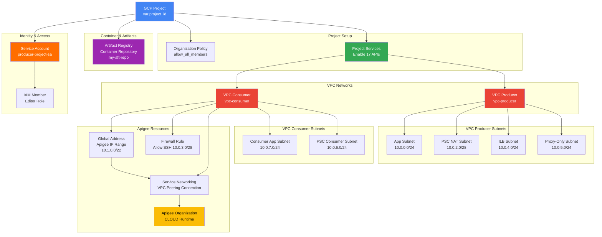

# GCP Terraform Resource Connectivity

## Architecture Overview

This document outlines the resource connectivity for the GCP Terraform infrastructure. The setup implements a multi-network topology with Apigee API Gateway, Cloud Run serverless compute, and Private Service Connect (PSC) for secure communication.

---

## Resource Connectivity Diagram

---

## Resource Components

### Project Setup
- **Organization Policy**: Allows all IAM members to ensure unrestricted access
- **Project Services**: Enables 17 required APIs including Cloud Run, Artifact Registry, Compute, Apigee, VPC Access, and networking services

### VPC Networks (2 Networks)
1. **VPC Producer** (`vpc-producer`)
   - Primary network for application deployment
   - Contains app, load balancing, and PSC services
   
2. **VPC Consumer** (`vpc-consumer`)
   - Secondary network for Apigee and cross-VPC communication
   - Connected to producer VPC via service networking

### VPC Producer Subnets (4 Subnets)
| Subnet | CIDR | Purpose |
|--------|------|---------|
| App Subnet | 10.0.0.0/24 | Application and Cloud Run deployment |
| PSC NAT Subnet | 10.0.2.0/28 | Private Service Connect NAT addresses |
| ILB Subnet | 10.0.4.0/24 | Internal Load Balancer deployment |
| Proxy-Only Subnet | 10.0.5.0/24 | Proxy rules for load balancing |

### VPC Consumer Subnets (2 Subnets)
| Subnet | CIDR | Purpose |
|--------|------|---------|
| Consumer App Subnet | 10.0.7.0/24 | Consumer workload deployment |
| PSC Consumer Subnet | 10.0.6.0/24 | PSC consumer forwarding rules |

### Apigee Resources
- **Apigee Organization**: Cloud-based API management with PAYG billing
- **IP Range**: Reserved VPC peering range (10.1.0.0/22)
- **Service Networking Connection**: VPC peering between consumer VPC and Apigee
- **Firewall Rule**: Allows SSH access on debugging subnet (10.0.3.0/28)

### Container & Artifact Management
- **Artifact Registry**: Docker container repository (`my-aft-repo`) in us-central1
  - Hosts container images for Cloud Run deployments

### Identity & Access
- **Service Account**: `producer-project-sa` with Editor role permissions
- Enables cross-service authentication and resource management

---

## Connectivity Flow

1. **Project Initialization** → Enable APIs → Create VPC Networks
2. **VPC Producer** → Create subnets for app, PSC, LB, and proxy
3. **VPC Consumer** → Create subnets for Apigee and PSC consumer
4. **Apigee Setup** → Reserve IP range → Create VPC peering connection → Deploy Apigee Org
5. **Container Registry** → Store container images for Cloud Run
6. **Service Account** → Associate with producer project for API access

---

## Notes

- Most Cloud Run and load balancer resources are currently **commented out** in the Terraform configuration
- The infrastructure is designed for secure, multi-network deployment with API gateway pattern
- Private Service Connect enables private connectivity between VPCs
- All resources are provisioned in the `us-central1` region

---

## Files Reference

- `main.tf`: VPC and subnet definitions
- `apigee-org.tf`: Apigee organization setup and VPC peering
- `gcr.tf`: Artifact Registry configuration
- `security.tf`: Service account and IAM roles
- `cloudrun.tf`: Cloud Run service (commented out)
- `alb.tf`: Application Load Balancer (commented out)
- `ilb.tf`: Internal Load Balancer (commented out)
- `psc.tf`: Private Service Connect attachment (commented out)
